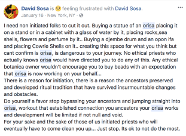

Now let me just say that occasionally religious divination will send you to make a space for a specific Orisha, that is a completely different scenario than what we are discussing here. Here, we are talking about setting up an altar, shrine or what have you because you want to/feel drawn to/had a dream/think “insert Orisha here” is amazing/etc and you go about it the same way you would any other deity you felt drawn to. STOP!

Here is a podcast from [Omileti Olubunmi](https://orishawisdom.podbean.com/e/session-4-orisha-shrines-oh-my/) about the subject. She makes excellent points about what can go wrong when you set up a space to worship/pray/give offerings to an Orisha that didn’t ask for that space. How do you know what is actually there. Is it Yemoja? Maybe… but it is WAY more likely some random spirit attracted to the attention. And if you think it won’t happen to you, think again. We see this time and time again. My friend David Sosa with Ty Shaw did a facebook live that covers the subject, you can watch that [here](https://www.facebook.com/david.sosa.1217/videos/10156133964036204/). I include these references from other iles and traditions to give perspective – it’s not just me who has an issue with this folks.

My Godson has this to say about the subject:
<!--more-->

Lukumi operates within a framework of rules. In fact, all ATRs/ADRs do.

In Lukumi we refer to that framework as the “rule of Ocha” (Regla de Ocha) which is also another way of referring to the religion. We are taught that the Orishas, specifically Yemoja (Achaba) and Shango established the Rule of Ocha/Regla for our survival and that one of Shango’s key roles is to enforce Regla and protect the overall structure of our traditions.

In Vodou you see similar principles manifest as “Reglemen.” These principles are multi-dimensional. There are Regla that exist across the entire religion, Regla that are lineage specific and Regla that are unique to particular branches of individual Orisha cults within the whole system or that are House specific and established by the deities in a particular Ile.

E.g. Asojano, the orisha who governs plagues, pestilence and the healing thereof suffered the indignity of having water thrown on open sores (which burned and caused him pain) and bread thrown at him in the streets while he wandered the towns after he was cursed by Olofin. As a result we have a rule/taboo that water and Asojano don’t mix and we keep water away from that Orisha, his ilekes and tools. He is also a very austere deity and requires a particular level of isolation, seclusion and respect when he resides in an Olorisha’s home that changes the acceptable behaviours one can allow to occur within their home. Some of us feel more strongly than others about those “rules” but they are still there and still expected to be followed.

Other Orishas have different rules where they can be placed, what can be put in front of them, who can work with them, etc…, those are part of our Regla. The rules and structure by which our practices function and thrive.

I mention this concept because this is actually at the heart of the issue many of us have with what is being passed around as acceptable practices with the Orishas in certain circles and communities (on the Festival circuit in particular). There are rules. There is structure. There is very little “whim” and “woo-woo.”

Violating Regla has varying degrees of consequences to it. Sometimes there are faux pas that get corrected or honest mistakes that get overlooked once or twice; other times there are things that are extremely offensive to individual Orishas & for which they will require appeasement and other times there are things which violate ewo (taboo) that are part of an individual priest’s framework of Reglas they must operate within. Regla functions to create a place where everyone can develop the best possible relationships with their communal and individual Spirits while preserving the structure of the religion.

Disrupting the structure of Regla at any level carries varying level of risks and consequences to a person, a community or the religion. So teaching people there are no rules and that they can build their own shrines and altars without license and then play Dial-a-Deity with the Orishas and our other Spirits (reducing them to genies in bottles granting magic wishes) literally breaks the Regla we agree to when we are initiated to various levels of Lukumi practices.

This is why some of us get extremely upset or disconcerted by what we see going on – because we have rules, structures and safeguards which govern how we interact with and serve the needs of our Spirits and our communities. Those Regla also shape and give boundaries to the way our Spirits manifest which keeps our religion functional AND keeps people from going crazy. — Oshunnike

So... what do you do? Find an ile to work with, work with your Egun, and pray to the Orisha in their designated place in nature. We are a tribal, community based religion that really cannot be worked alone.
